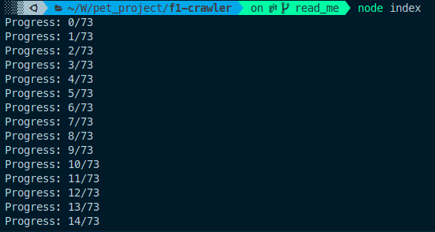
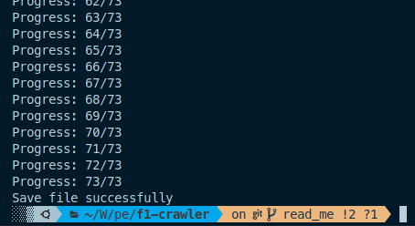

## FORMULA 1 CRAWL

This project is a crawler that crawl data from [https://www.formula1.com](https://www.formula1.com).
This project uses `axios` and `cheerio`

## Project Status

Complete

## Project Screen Shot(s)

Crawling:

Complete:

## Installation and Setup Instructions

Clone down this repository. You will need `node` and `npm` installed globally on your machine.

Installation packages:

`yarn`

To Start Crawling:

`node index`

After crawling successfully, you can see the saved data in file `data.json`
